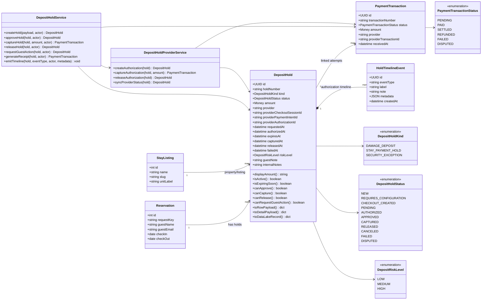

# DepositHold Class Diagram

This diagram defines the DepositHold aggregate and its relationship to Reservation and PaymentTransaction.

## Interpretation

`DepositHold` is the aggregate for authorization state.

It is not the same as a completed payment. It may create or link to PaymentTransaction objects when money movement occurs.
