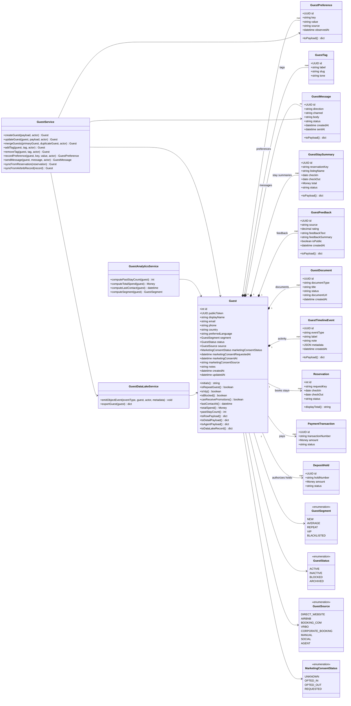

# Backend Class Diagram - Guest Aggregate

This diagram defines the backend domain model, aggregate boundaries, service layer, and supporting enums for the Guests workspace.

Current code alignment:

- `CustomerProfile` is the existing persistence model.
- `Guest` is the preferred domain/API/frontend vocabulary.
- Short term: wrap `CustomerProfile` with `Guest` services and serializers.
- Long term: migrate the aggregate name when risk is low.

## Backend interpretation

`Guest` is the aggregate root for guest relationship management.

Current persistence can remain `CustomerProfile` while services/API expose `Guest` vocabulary.

Guest owns the relationship story:

- identity and contact data
- source/channel
- preferred language
- segmentation
- marketing consent
- tags and preferences
- messages
- stay history
- feedback
- documents
- payments/deposits/reservation links
- activity timeline

Services coordinate workflows. They do not replace the object model.
