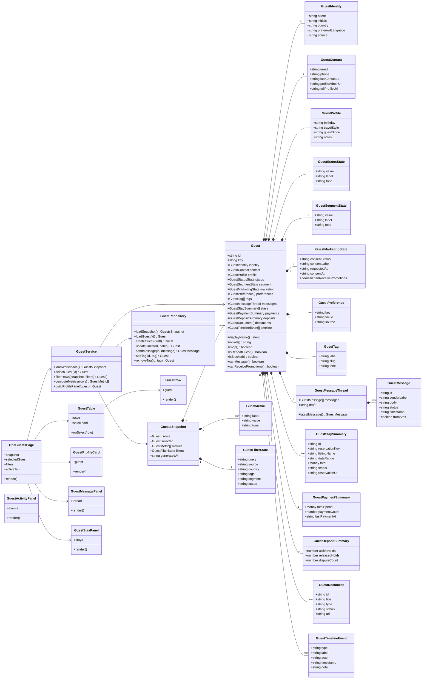

# Frontend Class Diagram - Guest Domain Projection

This diagram defines how the React frontend should represent the Guests workspace.

The frontend should not decorate loose rows with fake state. It should map API payloads into `Guest` domain objects and render projections from those objects.

## Frontend interpretation

`GuestRepository` handles API communication and mapping.

`GuestService` handles application-level operations such as filtering, selection, metrics, and action orchestration.

React components render object state. They must not invent business rules.
