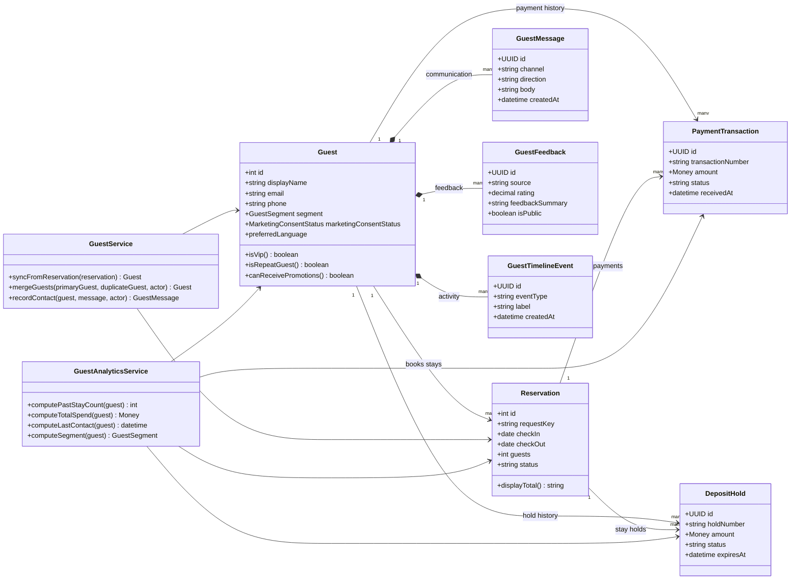
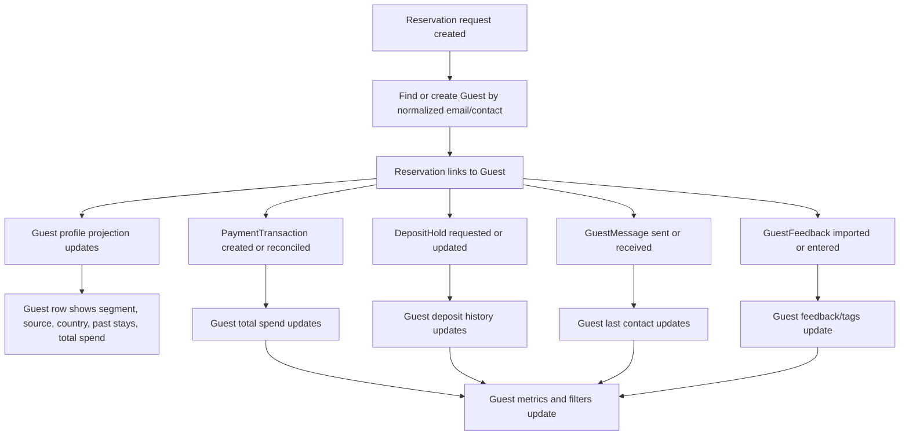

# Guest Relationship Diagram

Guest is a relationship aggregate. It connects reservations, payments, deposits, messages, feedback, and stay history without replacing those objects.

## Core distinction

```text
Guest = relationship and identity state.
Reservation = stay/booking state.
PaymentTransaction = money movement state.
DepositHold = authorization state.
```

## Relationship diagram



## Lifecycle bridge diagram



## Interpretation

A Guest should not own Reservation, PaymentTransaction, or DepositHold state directly.

A Guest owns identity, relationship, consent, preference, tag, message, feedback, and activity state.

Reservation, PaymentTransaction, and DepositHold remain their own aggregates and project summary information into the Guest workspace.
