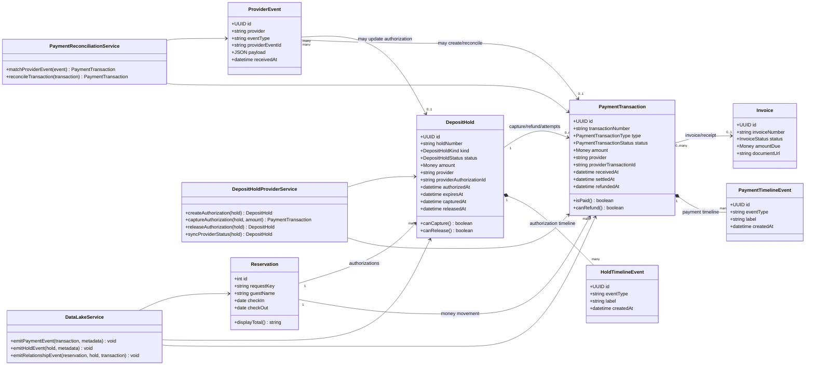
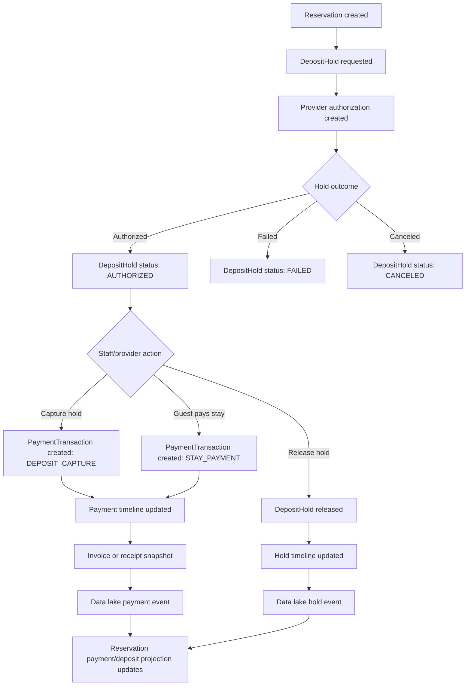

# PaymentTransaction and DepositHold Relationship Contract

Date: 2026-06-20
Status: design contract / implementation reference

Payments and deposit holds are separate objects, but they must be designed together.

## Core distinction

```text
DepositHold = authorization state.
PaymentTransaction = money movement state.
```

A hold can exist before money is captured.

A payment transaction exists when a provider/payment workflow creates a money-movement record, such as a paid stay charge, deposit capture, refund, failed charge, payout, or adjustment.

## Relationship rules

1. A Reservation may have many PaymentTransaction objects.
2. A Reservation may have many DepositHold objects.
3. A DepositHold may have many linked PaymentTransaction attempts.
4. A PaymentTransaction may optionally reference a DepositHold.
5. A PaymentTransaction must not be used as the source of truth for authorization expiration.
6. A DepositHold must not be used as the source of truth for settled revenue.
7. Provider references must never be deleted after creation.
8. Payment provider actions must be server-side only.
9. Capture/release/refund require explicit staff action unless a separate scheduled automation contract is approved.

## Relationship diagram



## Lifecycle bridge diagram



## UI ownership

Payments & Transactions page:

```text
PaymentTransaction objects
  -> metrics
  -> rows
  -> transaction detail panel
  -> invoice preview
  -> linked reservation
  -> deposit history
  -> payment timeline
```

Deposits & Holds page:

```text
DepositHold objects
  -> metrics
  -> rows
  -> expiring-soon panel
  -> selected hold detail
  -> authorization timeline
  -> linked payment attempts
  -> guest note
  -> hold actions
```

## Shared services

The two systems may share:

- provider clients
- webhook ingestion
- timeline/event logging
- data lake export
- money formatting
- reservation links
- invoice/receipt generation

They should not share aggregate state directly.

## Event bridge

A provider event can update both systems through services:

```text
provider webhook received
  -> PaymentProviderEvent stored
  -> PaymentReconciliationService matches/creates PaymentTransaction
  -> DepositHoldProviderService updates hold authorization state if relevant
  -> DataLakeService emits object events for both affected objects
```
