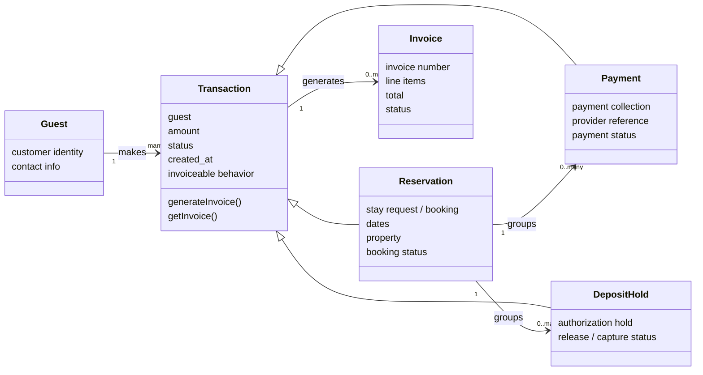

# Transaction Relationship Contract

Date: 2026-06-26
Status: simplified architecture clarification / pre-implementation contract

This document replaces the older split between payment and deposit-hold
relationship thinking with the simpler MLADIS transaction spine:

```text
Guest -> Transaction -> Reservation / Payment / DepositHold -> Invoice
```

Read `docs/architecture/transactions/README.md` before implementing changes in
Guests, Reservations, Payments, DepositHolds, Invoices, checkout, or financial
admin workflows.

## Core Rules

1. Guest makes Transactions.
2. Reservation, Payment, and DepositHold are transaction types.
3. Every Transaction is invoiceable.
4. A Transaction can generate or reference its own Invoice.
5. A Reservation transaction can group related Payment and DepositHold
   transactions.
6. DepositHold is the only deposit object.
7. Do not create Refund or Adjustment objects for now.
8. Release, capture, failure, expiration, and guest-action states belong inside
   DepositHold lifecycle.
9. Payment provider actions must be server-side only.
10. Provider references must never be deleted after creation.

## Relationship Diagram



## Current-Code Mapping

The current implementation is transitional.

| Simplified concept | Current code mapping |
|---|---|
| Guest | `CustomerProfile`, `BookingInquiry` guest fields, `User` when authenticated |
| Reservation transaction | `BookingInquiry` |
| Payment transaction | Invoice-backed payment projection, `ReservationPaymentHold` where payment authorization exists |
| DepositHold transaction | `DamageDeposit`, `ReservationPaymentHold` when used as an authorization hold |
| Invoice | `Invoice`, `InvoiceLineItem` |

Future implementation should move toward the transaction spine without
renaming database models blindly or breaking existing records.

## Invoice Rule

Invoice is not the parent of Transaction.

Instead:

```text
Transaction is invoiceable.
Invoice is the document generated from a Transaction.
```

Reservation, Payment, and DepositHold transactions can generate or reference
invoice/receipt documents through their transaction behavior.

## DepositHold Lifecycle Rule

Use `DepositHold`, not generic `Deposit`.

DepositHold already owns:

- authorization
- release
- capture
- failure
- expiration
- guest-action states

Released means the hold was lifted or canceled. Released is not always the same
as refunded, because money may never have been captured.

Do not introduce Refund or Adjustment objects unless Piter explicitly approves
a future financial lifecycle expansion.

## Real-Record-Only Rule

The platform must use real records only.

No fake rows.
No fake payment objects.
No fake deposit objects.
No fake guests.
No fake reservations.
No fake invoices.
No fake pagination.
No dead links.
No `href="#"`.

Fallback/sample data may only exist in tests or explicitly marked fixtures.
Production and normal local app behavior must be driven by real database
records.

## AI/Codex Warning

Do not treat Reservations, Payments, DepositHolds, Guests, and Invoices as
disconnected dashboard cards.

They must be modeled as one transaction graph:

```text
Guest -> Transaction -> Reservation / Payment / DepositHold -> Invoice
```

## Release Gate

Before implementing the transaction refactor, create a v3.1 release tag from
the current stable commit.

The v3.1 release must exist before model/service/UI refactor work begins.

Do not start the refactor without a rollback tag.

Do not create the v3.1 release tag in a documentation-only task.
