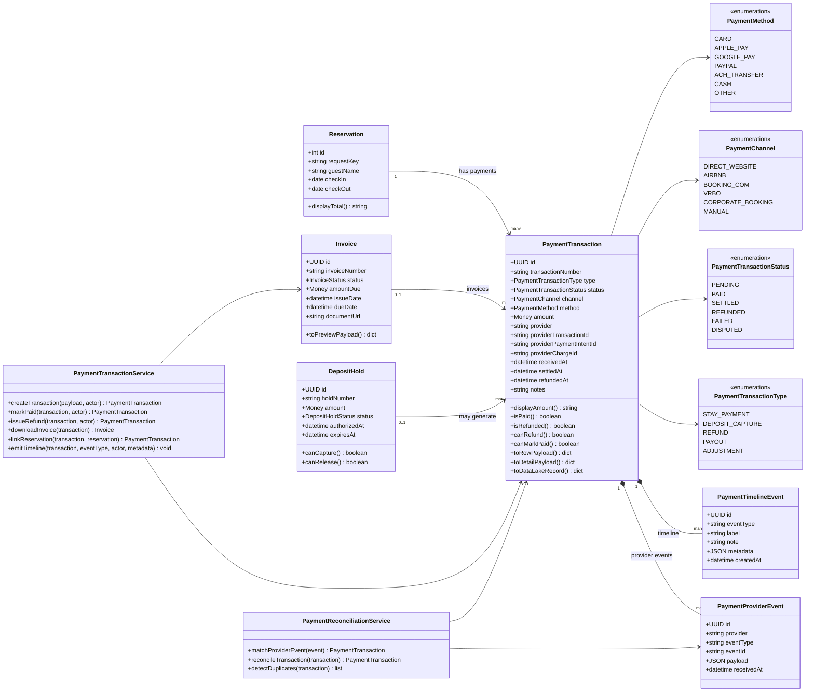

# PaymentTransaction Class Diagram

This diagram defines the PaymentTransaction aggregate and its relationship to Reservation, Invoice, DepositHold, and provider events.

## Interpretation

`PaymentTransaction` is the aggregate for money movement.

It is not the same as a deposit hold. It can be linked to a hold when a hold creates a capture, release, refund, failed attempt, or dispute-related payment record.
