# Backend Class Diagram - Reservation Aggregate

This diagram defines the backend domain model, aggregate boundaries, service layer, and supporting enums for the Reservations Workspace.

Current code alignment:

- `BookingInquiry` is the existing persistence model.
- `Reservation` is the preferred domain/API vocabulary.
- Short term: wrap `BookingInquiry` with `Reservation` services and serializers.
- Long term: migrate the aggregate name when risk is low.

```mermaid
classDiagram
direction LR

class Reservation {
  +int id
  +UUID publicToken
  +string requestKey
  +ReservationStatus status
  +ReservationChannel channel
  +ReservationRiskLevel riskLevel
  +string riskLabel

  +string guestName
  +string guestEmail
  +string guestPhone
  +int guestCount
  +string sourceCountry

  +date checkIn
  +date checkOut
  +int nights
  +string dateRangeLabel

  +Money subtotal
  +Money discount
  +Money depositAmount
  +Money stayPaymentAmount
  +Money totalAmount
  +string currency

  +boolean propertyRulesAccepted
  +boolean damageTermsAccepted
  +datetime propertyRulesAcceptedAt
  +datetime damageTermsAcceptedAt

  +datetime createdAt
  +datetime updatedAt
  +datetime canceledAt
  +string cancellationReason
  +string adminNotes

  +displayTotal() string
  +displayDeposit() string
  +displayStayPayment() string
  +canCancel() boolean
  +canConfirm() boolean
  +canSendCheckInInstructions() boolean
  +requiredDocumentsAccepted() boolean
  +toRowPayload() dict
  +toDetailPayload() dict
  +toAgentPayload() dict
  +toDataLakeRecord() dict
}

class ReservationGuest {
  +int id
  +string name
  +string email
  +string phone
  +string segment
  +string source
  +string marketingConsentStatus
  +string profileAdminUrl
}

class ReservationStay {
  +int id
  +string name
  +string slug
  +string unitLabel
  +string locationLabel
  +int maxGuests
  +string publicUrl
  +string adminUrl
}

class ReservationPaymentPlan {
  +UUID id
  +Money depositDue
  +Money firstPaymentDue
  +Money finalPaymentDue
  +Money totalDue
  +ReservationPaymentStatus status
  +boolean isFullyPaid
  +toTimelinePayload() dict
}

class ReservationPayment {
  +UUID id
  +Money amount
  +string provider
  +ReservationPaymentStatus status
  +string providerReference
  +datetime createdAt
  +datetime paidAt
}

class ReservationDepositHold {
  +UUID id
  +Money amount
  +string provider
  +ReservationDepositStatus status
  +datetime authorizedAt
  +datetime expiresAt
  +datetime capturedAt
  +datetime releasedAt
  +canCapture() boolean
  +canRelease() boolean
}

class ReservationMessage {
  +UUID id
  +string direction
  +string channel
  +string body
  +string status
  +datetime createdAt
  +datetime sentAt
  +toPayload() dict
}

class ReservationDocumentAcceptance {
  +UUID id
  +string documentType
  +string version
  +datetime acceptedAt
  +string ipAddress
  +string userAgent
}

class ReservationTimelineEvent {
  +UUID id
  +string eventType
  +string label
  +string note
  +JSON metadata
  +datetime createdAt
  +toPayload() dict
}

class ReservationAgentAssessment {
  +UUID id
  +ReservationRiskLevel riskLevel
  +string suggestedReply
  +string[] missingInformation
  +string[] recommendedActions
  +JSON signals
  +datetime generatedAt
}

class ReservationService {
  +createReservation(payload, actor) Reservation
  +updateReservation(reservation, payload, actor) Reservation
  +transitionStatus(reservation, nextStatus, actor, note) Reservation
  +sendMessage(reservation, message, actor) ReservationMessage
  +approveDeposit(reservation, actor) ReservationDepositHold
  +releaseDeposit(reservation, actor) ReservationDepositHold
  +generateInvoice(reservation, actor) ReservationPayment
  +recordDocumentAcceptance(reservation, documentType, version, actor) ReservationDocumentAcceptance
}

class ReservationAgentService {
  +assessRisk(reservation) ReservationAgentAssessment
  +suggestReply(reservation) string
  +recommendActions(reservation) list
}

class ReservationDataLakeService {
  +emitObjectEvent(eventType, reservation, actor, metadata) void
  +exportReservation(reservation) dict
}

class ReservationStatus {
  <<enumeration>>
  NEW
  REVIEWING
  QUOTED
  CONFIRMED
  HOLD
  COMPLETED
  CANCELED
  DECLINED
}

class ReservationChannel {
  <<enumeration>>
  DIRECT_WEBSITE
  AIRBNB
  MANUAL
  SOCIAL
  AGENT
}

class ReservationPaymentStatus {
  <<enumeration>>
  UNPAID
  PENDING
  PAID
  FAILED
  REFUNDED
  PARTIAL
}

class ReservationDepositStatus {
  <<enumeration>>
  NONE
  PENDING
  AUTHORIZED
  CAPTURED
  RELEASED
  FAILED
}

class ReservationRiskLevel {
  <<enumeration>>
  LOW
  MEDIUM
  HIGH
}

Reservation "1" *-- "1" ReservationGuest : guest
Reservation "1" *-- "1" ReservationStay : stay
Reservation "1" *-- "1" ReservationPaymentPlan : payment plan
Reservation "1" *-- "many" ReservationPayment : payments
Reservation "1" *-- "0..1" ReservationDepositHold : deposit hold
Reservation "1" *-- "many" ReservationMessage : messages
Reservation "1" *-- "many" ReservationDocumentAcceptance : document acceptances
Reservation "1" *-- "many" ReservationTimelineEvent : activity
Reservation "1" *-- "0..1" ReservationAgentAssessment : fairagent

Reservation --> ReservationStatus
Reservation --> ReservationChannel
Reservation --> ReservationRiskLevel
ReservationPayment --> ReservationPaymentStatus
ReservationDepositHold --> ReservationDepositStatus

ReservationService --> Reservation
ReservationService --> ReservationPayment
ReservationService --> ReservationDepositHold
ReservationService --> ReservationMessage
ReservationService --> ReservationDocumentAcceptance
ReservationService --> ReservationDataLakeService
ReservationAgentService --> Reservation
ReservationAgentService --> ReservationAgentAssessment
```

## Backend interpretation

`Reservation` is the aggregate root.

Current persistence can remain `BookingInquiry` while services/API expose `Reservation` vocabulary.

Reservation owns the operational story:

- guest identity
- stay/listing
- dates/nights
- status
- payment plan
- deposit hold
- messages
- required document acceptance
- activity timeline
- FairAgent risk/reply/action assessment

Services coordinate workflows. They do not replace the object model.
