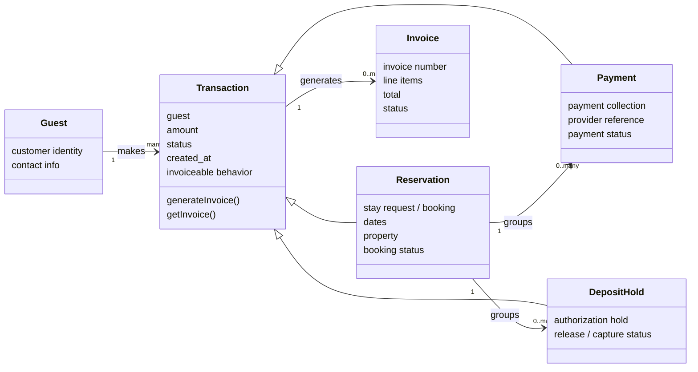

# MLADIS Transaction Architecture

Date: 2026-06-26
Status: architecture clarification / pre-implementation contract

This document is the canonical transaction-spine contract for MLADIS.

It clarifies the simpler platform model future implementation work must follow:

```text
Guest -> Transaction -> Reservation / Payment / DepositHold -> Invoice
```

This is documentation only. It does not describe a completed model migration.
Current code is transitional and must be moved toward this contract only after
the release gate below is satisfied.

## Core Rules

- Guest makes Transactions.
- Reservation, Payment, and DepositHold are transaction types.
- Every Transaction is invoiceable.
- A Transaction can generate or reference its own Invoice.
- A Reservation transaction can group related Payment and DepositHold
  transactions.
- DepositHold is the only deposit object.
- Do not create Refund or Adjustment objects for now.
- Release, capture, failure, expiration, and guest-action states belong inside
  the DepositHold lifecycle.

## High-Level Relationship Model



## Terms

### Guest

Guest is the person/customer identity.

Current implementation may use:

- `CustomerProfile`
- `BookingInquiry` guest fields
- `User` when authenticated

Long-term role:

```text
Guest is the customer identity that owns transactions.
```

### Transaction

Transaction is the shared parent/domain concept.

A transaction must know:

- guest
- amount
- status
- currency
- created_at
- source object
- invoice behavior

A transaction can:

- generate invoice
- get invoice
- generate receipt
- expose timeline
- expose provider/reference details when relevant

Transaction is not a dashboard row. Rows, detail panels, timeline entries,
invoice cards, and action buttons are projections of transaction state.

### Reservation

A reservation is a transaction type.

It represents:

- stay request
- booking dates
- property/listing
- booking status
- guest context

Current implementation may map to:

- `BookingInquiry`

A reservation can group related:

- Payment transactions
- DepositHold transactions
- Invoices

### Payment

A payment is a transaction type.

It represents:

- money collection
- provider reference
- payment status
- invoice/receipt behavior

Current implementation may expose payments through invoice-backed payment
projections, payment rows, or reservation payment authorization records while
the transaction spine is being formalized.

### DepositHold

Use the name `DepositHold`, not generic `Deposit`.

A DepositHold is a transaction type.

It represents:

- security/damage authorization hold
- provider authorization state
- release/capture/failure/expiration lifecycle

Do not introduce separate Refund or Adjustment objects at this stage.

`Released` means the hold was lifted or canceled. Released is not always the
same as refunded, because money may never have been captured.

### Invoice

An invoice is not the parent of Transaction.

Instead:

```text
Transaction is invoiceable.
Invoice is the document generated from a Transaction.
```

## Current-Code Mapping

Current implementation is transitional. It must remain stable while future work
moves toward the simpler transaction spine.

| Transaction-spine concept | Current code mapping |
|---|---|
| Guest | `CustomerProfile`, `BookingInquiry` guest fields, `User` when authenticated |
| Reservation transaction | `BookingInquiry` |
| Payment transaction | Invoice-backed payment projection, `ReservationPaymentHold` where payment authorization exists |
| DepositHold transaction | `DamageDeposit`, `ReservationPaymentHold` when used as an authorization hold |
| Invoice | `Invoice`, `InvoiceLineItem` |

Do not rename database models just to match this document. Implementation work
must wrap current models safely first, then migrate deliberately only after a
reviewed model plan exists.

## Real-Record-Only Rule

The platform must use real records only.

No fake rows.
No fake payment objects.
No fake deposit objects.
No fake guests.
No fake reservations.
No fake invoices.
No fake pagination.
No dead links.
No `href="#"`.

Fallback/sample data may only exist in tests or explicitly marked fixtures.
Production and normal local app behavior must be driven by real database
records.

## AI/Codex Implementation Warning

Future AI/Codex agents must not treat Reservations, Payments, DepositHolds,
Guests, and Invoices as disconnected dashboard cards.

They must be modeled as one transaction graph:

```text
Guest -> Transaction -> Reservation / Payment / DepositHold -> Invoice
```

Do not create Refund or Adjustment objects unless Piter explicitly approves a
future financial lifecycle expansion.

DepositHold lifecycle already covers release, capture, failure, expiration, and
guest-action states.

## Release Gate Before Implementation

Before implementing the transaction refactor, create a v3.1 release tag from
the current stable commit.

The v3.1 release must exist before model/service/UI refactor work begins.

Do not start the refactor without a rollback tag.

Do not create the v3.1 release tag as part of a documentation-only task.
