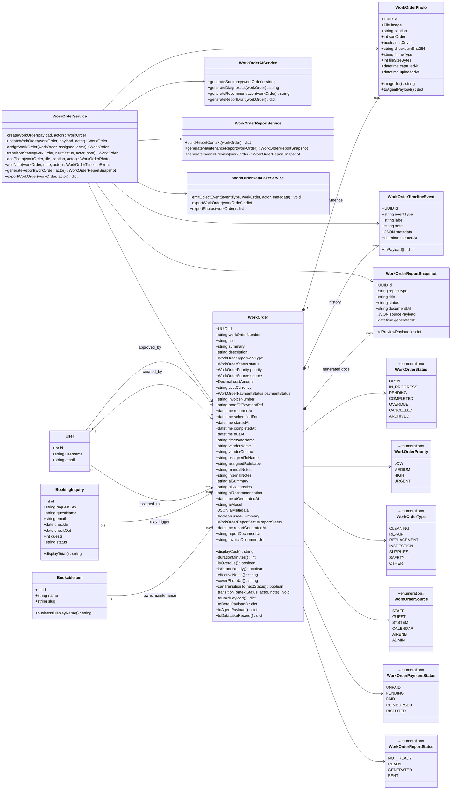
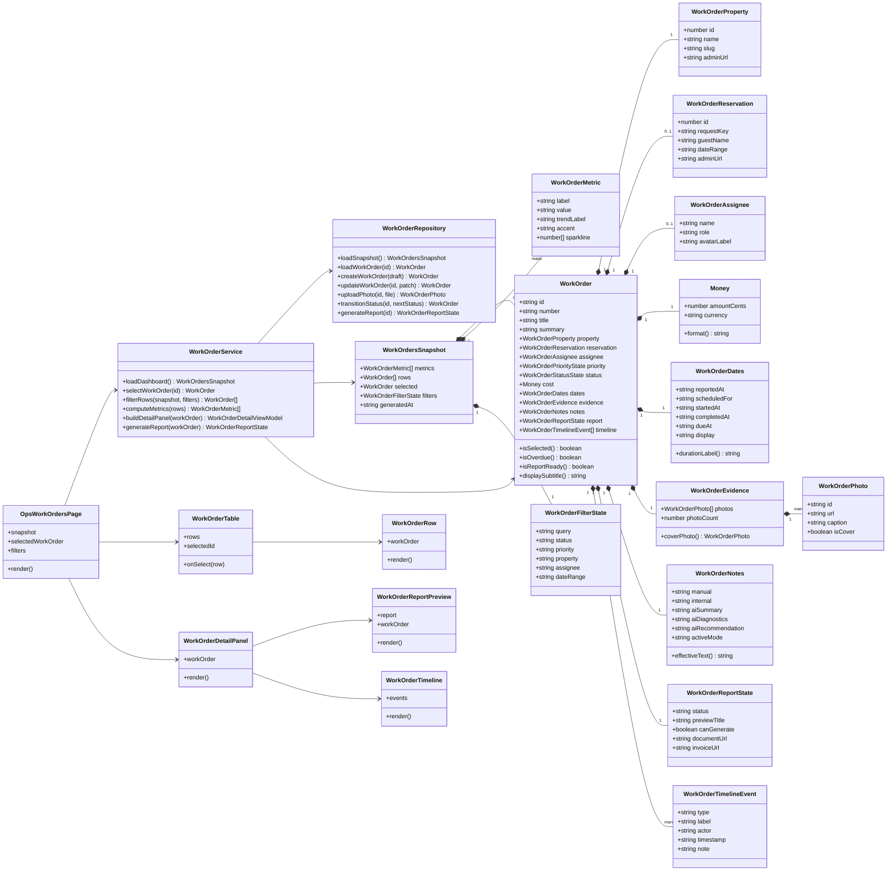

# MLADIS Work Order OOP Class Design

Date: 2026-06-19
Status: design contract / implementation reference

## Purpose

This document defines the object-oriented design for the MLADIS Maintenance & Work Orders section.

The screen must not be implemented as disconnected cards, loose JSON blobs, or UI-only mock data. The screen is a projection of domain objects.

Core rule:

```text
WorkOrder is the source object.
The list row, selected detail panel, report preview, photo strip, metrics, filters, and timeline are projections of WorkOrder state.
```

This is the design rule that keeps MLADIS from becoming random UI code.

## Existing Code Alignment

The current codebase already has a maintenance foundation:

- `MaintenanceEvent` exists as the current backend aggregate root.
- `MaintenancePhoto` exists as the child evidence entity.
- `OpsMaintenanceEvent` exists as the current frontend domain projection.
- `OpsMaintenancePage` exists as the current UI page.
- `docs/maintenance-mvc-architecture.md` defines the first MVC/OOP contract for maintenance.

The next implementation should either:

1. Rename `MaintenanceEvent` to `WorkOrder`, preferred long-term vocabulary, or
2. Keep `MaintenanceEvent` internally for migration safety while wrapping it with a clearer `WorkOrder` domain/API vocabulary.

The product language should become `WorkOrder` because the page is explicitly about work orders, assignment, workflow, cost, evidence, reports, and operational history.

## Backend Class Diagram



## Frontend Class Diagram



## Domain Object Contract

### WorkOrder

`WorkOrder` is the aggregate root. Every card, table row, detail panel, report preview, timeline entry, and metric must be derived from one or more `WorkOrder` objects.

Primary attributes:

- identity: `id`, `workOrderNumber`
- title: `title`, `summary`, `description`
- classification: `workType`, `source`
- workflow: `status`, `priority`
- property relationship: `item`
- optional reservation relationship: `reservation`
- assignment: `assignedToName`, `assignedToUser`, `vendorName`, `vendorContact`
- cost/payment: `costAmount`, `costCurrency`, `paymentStatus`, `invoiceNumber`, `proofOfPaymentRef`
- time: `reportedAt`, `scheduledFor`, `startedAt`, `completedAt`, `dueAt`, `timezoneName`
- evidence: `photos`
- notes: `manualNotes`, `internalNotes`, `aiSummary`, `aiDiagnostics`, `aiRecommendation`
- generated docs: `reportStatus`, `reportDocumentUrl`, `invoiceDocumentUrl`
- audit: timeline events and data-lake events

### WorkOrderPhoto

`WorkOrderPhoto` is a child entity. Photos must not be stored as an array or comma-separated field on the parent object.

Photo objects support:

- proof/evidence
- report generation
- AI diagnostics
- cover thumbnail selection
- checksum-based duplicate detection

### WorkOrderTimelineEvent

Timeline events preserve the operational story of the work order.

Examples:

- `work_order_created`
- `work_order_assigned`
- `work_order_status_changed`
- `work_order_note_added`
- `work_order_photo_uploaded`
- `work_order_report_generated`

### WorkOrderReportSnapshot

Reports are generated snapshots. A generated report must not replace the source WorkOrder. It should capture the data used to generate the document at that moment.

This preserves auditability.

## Backend Validation Rules

A WorkOrder can be created when it has:

- property/listing
- title
- status
- priority
- reported time

A WorkOrder becomes report-ready when it has:

- property/listing
- title
- cost
- status
- notes or AI summary
- at least one photo or documented exception
- linked reservation when caused by a stay
- timeline history

A WorkOrder becomes completed when:

- status transition is valid
- completed time is present or automatically set
- required notes are present
- required evidence exists or is explicitly waived by staff

## Service Layer Contract

Controllers and UI components must not directly implement business rules.

Required service classes:

```python
class WorkOrderService:
    def create_work_order(self, payload, actor): ...
    def update_work_order(self, work_order, payload, actor): ...
    def assign_work_order(self, work_order, assignee, actor): ...
    def transition_status(self, work_order, next_status, actor, note=""): ...
    def add_photo(self, work_order, file, caption, actor): ...
    def add_note(self, work_order, note, actor): ...
    def generate_report(self, work_order, actor): ...
    def export_work_order(self, work_order, actor): ...
```

```python
class WorkOrderAIService:
    def generate_summary(self, work_order): ...
    def generate_diagnostics(self, work_order): ...
    def generate_recommendation(self, work_order): ...
    def generate_report_draft(self, work_order): ...
```

```python
class WorkOrderReportService:
    def build_report_context(self, work_order): ...
    def generate_maintenance_report(self, work_order): ...
    def generate_invoice_preview(self, work_order): ...
```

```python
class WorkOrderDataLakeService:
    def emit_object_event(self, event_type, work_order, actor, metadata): ...
    def export_work_order(self, work_order): ...
    def export_photos(self, work_order): ...
```

## API Contract

Recommended endpoints:

```text
GET    /api/ops/work-orders/
POST   /api/ops/work-orders/
GET    /api/ops/work-orders/<uuid>/
PATCH  /api/ops/work-orders/<uuid>/
POST   /api/ops/work-orders/<uuid>/assign/
POST   /api/ops/work-orders/<uuid>/transition/
POST   /api/ops/work-orders/<uuid>/photos/
POST   /api/ops/work-orders/<uuid>/notes/
POST   /api/ops/work-orders/<uuid>/generate-report/
GET    /api/ops/work-orders/<uuid>/agent-payload/
GET    /api/ops/work-orders/<uuid>/timeline/
```

## Frontend Implementation Contract

Recommended files:

```text
frontend/src/domain/work-orders.ts
frontend/src/application/WorkOrderService.ts
frontend/src/infrastructure/WorkOrderRepository.ts
frontend/src/ui/pages/OpsWorkOrdersPage.tsx
frontend/src/ui/components/work-orders/WorkOrderMetricCard.tsx
frontend/src/ui/components/work-orders/WorkOrderTable.tsx
frontend/src/ui/components/work-orders/WorkOrderRow.tsx
frontend/src/ui/components/work-orders/WorkOrderDetailPanel.tsx
frontend/src/ui/components/work-orders/WorkOrderTimeline.tsx
frontend/src/ui/components/work-orders/WorkOrderReportPreview.tsx
frontend/src/ui/components/work-orders/WorkOrderPhotoStrip.tsx
```

Rules:

- Domain classes live in `frontend/src/domain`.
- API/repository classes live in `frontend/src/infrastructure`.
- Service/factory logic lives in `frontend/src/application`.
- React components live in `frontend/src/ui`.
- UI components render state; they do not invent business rules.

## UI Projection Rules

The Maintenance & Work Orders page contains:

1. Metrics row
2. WorkOrder table/list
3. Selected WorkOrder detail panel
4. Photo evidence strip
5. Linked listing/reservation section
6. AI-generated report preview
7. Activity timeline

Each part must be a projection of WorkOrder state.

### Metrics

Metrics are computed from WorkOrder objects:

- open work orders
- overdue items
- this month cost
- completed jobs

### Table Row

Each row shows:

- title
- property
- reservation
- assigned to
- priority
- cost
- date
- status

### Detail Panel

The selected WorkOrder drives:

- header number/status/title
- action buttons
- cost/time/assignee/priority/status summary
- pictures
- notes
- linked listing
- linked reservation
- AI-generated report preview
- activity timeline

## Data Lake / Event Logging

Every important action emits an object event:

```text
work_order_created
work_order_updated
work_order_assigned
work_order_status_changed
work_order_photo_uploaded
work_order_note_added
work_order_report_generated
work_order_exported
```

Each event should include:

- work_order_id
- property_id
- reservation_id if available
- actor_id
- old status
- new status
- cost amount/currency
- priority
- timestamp
- request/session metadata when available

## Design Principle

The UI does not contain cards.

The UI contains WorkOrder objects, and cards are only visual projections of those objects.

This is the MLADIS way: design the object system first, then let the frontend and backend express that system consistently.
