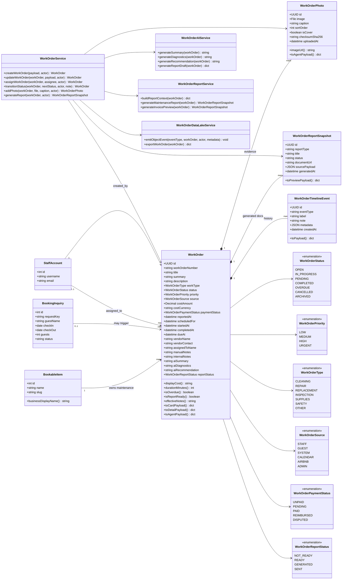

# Backend Class Diagram - WorkOrder Aggregate

This diagram defines the backend domain model, aggregate boundaries, service layer, and supporting enums for the Work Orders system.

## Backend interpretation

`WorkOrder` is the aggregate root.

`WorkOrderPhoto`, `WorkOrderTimelineEvent`, and `WorkOrderReportSnapshot` are child entities owned by the aggregate.

`BookableItem`, `BookingInquiry`, and `StaffAccount` are external domain objects referenced by the aggregate.

Services coordinate workflows. They do not replace the object model.
