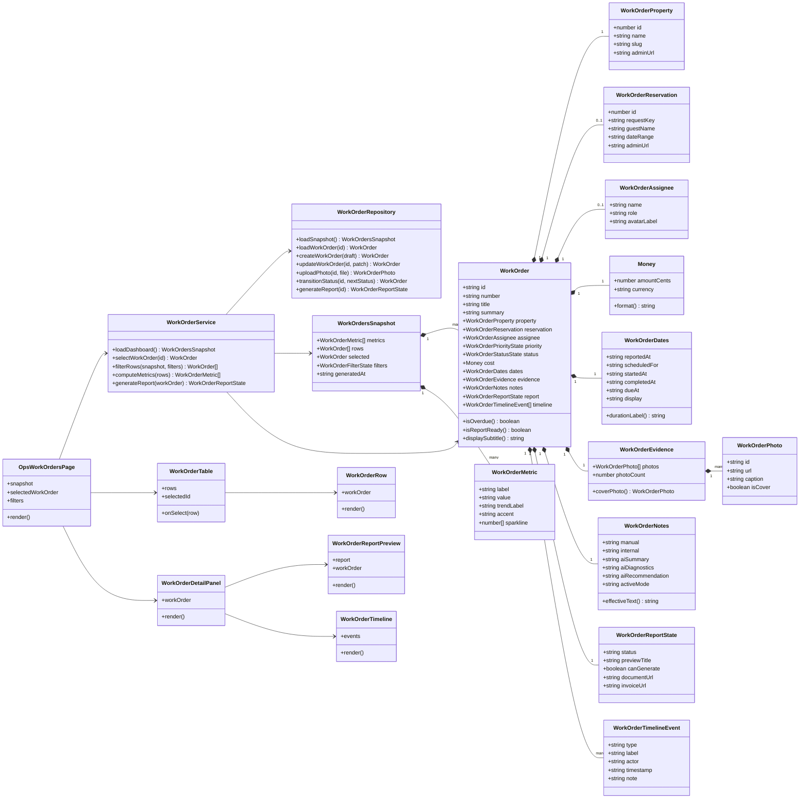

# Frontend Class Diagram - WorkOrder Domain Projection

This diagram defines how the React frontend should represent work orders.

The frontend should not receive loose card data. It should map API payloads into domain objects and then render those objects.

## Frontend interpretation

`WorkOrderRepository` handles API communication and mapping.

`WorkOrderService` handles application-level operations such as filtering, selection, and report generation.

React components render object state. They must not invent business rules.
