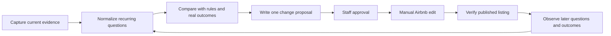

# Airbnb Listing Improvement Runbook

## Status and boundary

This runbook prepares a repeatable, evidence-first process for improving the
MLADIS Airbnb listing while the business transitions to its own platform. It
does not edit Airbnb automatically. A staff operator must approve every listing
change and verify the published result.

The current preparation pass does not change the listing, send a customer
message, or claim that an improvement has been published.

## Evidence sources

Use the strongest available source in this order:

1. current property rules and approved operations documents;
2. rendered Airbnb listing and arrival-guide DOM;
3. anonymized conversation themes and recurring questions;
4. reservation outcomes, occupancy, earnings, ratings, and reviews;
5. MLADIS support, payment, deposit, calendar, and maintenance records.

Keep raw captures and private records outside Git. The interaction and
reservation collection process is documented in the [Airbnb collection
runbook](../../data-store/airbnb-collection-runbook.md).

## Audit dimensions

Every listing audit should inspect the following dimensions and mark each item
as `observed`, `missing`, `ambiguous`, `stale`, `proposed`, or `verified`.

| Dimension | Questions to answer | MLADIS impact |
|---|---|---|
| Listing identity | Is the title, property, bedroom/bath count, capacity, and location consistent? | `Property` and listing projections must agree. |
| Guest capacity | Are maximum overnight guests, registered guests, visitors, and day use clearly distinguished? | Reservation validation and response escalation. |
| Rules and parties | Are quiet hours, smoking, parties, gatherings, visitors, parking, pool, and shared-space rules current and unambiguous? | Rules-first response and required written acceptance. |
| Arrival and access | Can a guest understand airport transfer, check-in time, access devices, parking, and emergency contact steps? | Reservation arrival-guidance projection. |
| Amenities | Are pool, Wi-Fi, appliances, workspace, accessibility, and shared facilities accurately described? | Availability answers and issue prevention. |
| Photos | Do photos prove the actual bedrooms, bathrooms, exterior, pool, entrances, and safety-relevant features? | Listing trust and guest expectation matching. |
| Pricing and fees | Are nightly price, cleaning/service fees, deposit, payment timing, and cancellation language understandable? | Reservation, payment, deposit, and invoice projections. |
| Availability | Do calendar blocks, minimum stays, check-in/out rules, and pricing overrides reflect operations? | `CalendarWorkspace` and reservation creation. |
| Reviews and friction | What recurring questions, complaints, compliments, or expectation gaps appear? | Prioritize changes by frequency and business risk. |

## Improvement workflow



### 1. Capture

Use read-only Airbnb DOM capture and the private data-lake resume command. Do
not use screenshots as the only source for structured facts. Record the capture
date and source scope, but keep customer identifiers and raw conversation text
in the private evidence store.

### 2. Identify friction

Group recurring guest questions into short, distinct themes, such as:

- whether a one-night stay permits visitors;
- whether a gathering is a party under the current rules;
- how many people may sleep overnight;
- what is included in the deposit and when it is released;
- how to reach the property from the airport;
- what the pool, parking, check-in, or shared-space expectations are.

Do not treat a customer's wording as permission. Compare every theme against
the current property rule and observed reservation outcome.

### 3. Propose one change at a time

Each proposal must contain:

```text
proposal_id
listing/property
evidence_sources
current_wording_or_gap
proposed_wording_or_asset_change
rule_or_business_reason
affected_guest_behavior
affected_mladis_object_or_route
risk_and_rollback
owner_approval
published_observation
```

Keep proposed customer-facing wording short. Use separate paragraphs for
separate ideas. Keep greetings separate from the first substantive paragraph.
Do not overload the listing with every operational rule; link to a clear rules
page when the platform supports it, while keeping the critical restriction
visible in the listing itself.

### 4. Approve and publish

A staff operator reviews the proposal against the current property rules,
legal/business constraints, and actual operations. Only the operator edits the
Airbnb listing. MLADIS records the proposal and approval evidence; it does not
silently edit the listing.

### 5. Verify and learn

After publication, verify the rendered Airbnb listing and compare later
questions, reservation conversion, cancellations, reviews, and operational
issues. Mark the proposal `verified` only when the published result and the
expected behavior are both observed. If the change creates confusion, record a
rollback proposal rather than silently overwriting history.

## Safety rules for the response agent

- Rules are checked before prior conversation patterns.
- A reservation holder remains solely responsible for everything during the
  reservation, regardless of who does what.
- A gathering is not automatically a party, but parties remain prohibited when
  the property rules prohibit them; ambiguous cases escalate.
- Overnight guest count, visitors, day use, and parties are separate concepts.
- The agent may draft an answer but cannot send it in the current workflow.
- The agent must never promise an exception, approval, refund, or availability
  that the current records do not support.

## Outputs and tracking

Store private evidence and proposed edits outside Git. Store only sanitized
proposal summaries, object/route impact, approval state, and verification links
in the repository. Add each implementation or listing change to the MLADIS
[feature verification ledger](../../qa/feature-verification-ledger.md) with
independent local and production statuses. A visual improvement is not a
functional pass until the corresponding object, route, or customer outcome is
verified.

## Related documents

- [Airbnb-to-MLADIS behavior map](airbnb-platform-behavior-map.md)
- [Customer service playbook](customer-service-playbook.md)
- [Response automation runbook](airbnb-response-automation-runbook.md)
- [Airbnb collection runbook](../../data-store/airbnb-collection-runbook.md)
