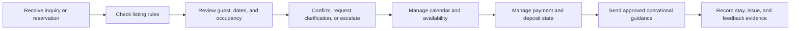
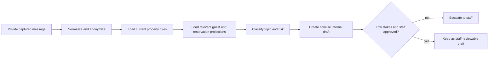

# Airbnb-to-MLADIS Platform Behavior Map

## Status

This document prepares the behavior-mapping work for the Airbnb transition. It
does not change Airbnb, send customer messages, create live reservations, or
claim that every mapped behavior is implemented in MLADIS. It is the working
contract for comparing observed Airbnb behavior with the platform objects and
workspaces MLADIS must provide.

The three transition tracks are:

| Track | Prepared artifact | Current boundary |
|---|---|---|
| A. Customer responses | [Airbnb response automation runbook](airbnb-response-automation-runbook.md) | Draft-only; no sender adapter and no real-customer test in the current preparation pass. |
| B. User behavior mapping | This document | Behavior and object map prepared; implementation gaps remain tracked below. |
| C. Listing improvement | [Airbnb listing improvement runbook](airbnb-listing-improvement-runbook.md) | Audit and change-approval process prepared; no listing edit is automated. |

## Source and privacy boundary

The behavior map is built from:

1. read-only rendered Airbnb DOM captures;
2. normalized reservation snapshots;
3. anonymized interaction records;
4. current MLADIS reservation, guest, payment, deposit, calendar, and agent
   workspaces;
5. approved property rules and operations documentation.

Raw names, contact values, thread URLs, credentials, payment-card data, and
identity documents stay in the private evidence store. Git documentation uses
event names, object contracts, and sanitized examples only. The repeatable
collection entry point is:

```bash
cd airbnb_agent
./scripts/resume_airbnb_data_lake.sh /private/path/airbnb-combined-export.jsonl
```

That command resumes from the private checkpoint and imports only unseen
conversation and reservation captures. It is the same path whether a read-only
browser agent created the export or an operator supplied it later.

## Actor journeys

### Guest or prospective guest

```mermaid
flowchart LR
  A[Discover listing] --> B[Ask question]
  B --> C[Review availability and rules]
  C --> D[Choose dates and guest count]
  D --> E[Submit reservation request]
  E --> F[Accept rules and required terms]
  F --> G[Pay or authorize required amounts]
  G --> H[Receive confirmation and arrival guidance]
  H --> I[Stay and communicate]
  I --> J[Check out and leave feedback]
```



MLADIS must preserve the guest's current step, show the next required action,
and keep the reservation holder associated with every reservation event.

### Host or staff operator



The operator is the approval boundary for exceptions, high-risk questions,
listing edits, outbound messages, refunds, cancellations, and other actions
with financial or customer-facing consequences.

### MLADIS response agent



The response code is intentionally draft-first:

- `airbnb_agent/bookings/airbnb_response_workflow.py` owns classification,
  escalation, formatting, approval, and the fail-closed send guard.
- `airbnb_agent/bookings/management/commands/draft_airbnb_response.py` accepts
  one private message and returns a structured `draft_only` result.
- No Airbnb sender adapter is configured. The workflow must not be treated as
  a customer-writing automation until a separate sender design and approved
  live test exist.

## Behavior-to-platform map

| Observed behavior or event | Source evidence | MLADIS object/projection | Required platform capability |
|---|---|---|---|
| Guest asks about availability | Conversation capture and listing facts | `Guest`, `Reservation` inquiry, `CalendarWorkspace` | Show availability from current records and preserve the inquiry context. |
| Guest changes dates or guest count | Conversation plus reservation snapshot | `Reservation` and `Guest` | Recalculate nights, occupancy, price, rules, and approval state together. |
| Guest asks about visitors, gatherings, or parties | Conversation plus property rules | `Property`, `Reservation`, response-risk projection | Apply rules first, distinguish overnight guests from visitors, and escalate ambiguity. |
| Guest accepts rules or terms | Reservation/payment flow | `Reservation`, `DepositHold`, consent/audit event | Store the acceptance evidence and show the next required payment or review action. |
| Guest pays or authorizes a hold | Payment/deposit record | `PaymentTransaction`, `DepositHold`, `Invoice` | Link financial state to the reservation and guest; never represent a string-only payment. |
| Guest asks for arrival help | Conversation and arrival guidance | `Reservation`, arrival-guidance projection | Provide the approved airport and property instructions without exposing private data. |
| Guest reports an issue | Conversation and maintenance record | `Guest`, `Reservation`, `WorkOrder` | Open or link an operational task with ownership and timeline evidence. |
| Guest completes a stay | Reservation and review fields | `Reservation`, `Guest`, feedback projection | Preserve check-in/out, nights, spend, rating, review, and repeat-stay signals when present. |
| Guest returns or asks about a future stay | Reservation history and interactions | `Guest`, last-stays projection | Show verified history and avoid inferring consent or identity from message text alone. |
| Host changes listing facts or rules | Approved listing audit | `Property`, rules/content projections | Record proposed, approved, published, and observed states separately. |

## Object relationship contract

The platform should expose one connected behavior graph rather than unrelated
dashboard cards:

```text
Guest
  -> Reservation / BookingInquiry
  -> PaymentTransaction
  -> DepositHold
  -> Invoice
  -> Interaction and timeline evidence
```

For each captured event, the implementation should record:

- `source_system` and source scope;
- stable internal object key when a real relationship exists;
- event type and observed timestamp;
- actor role (`guest`, `staff`, `agent`, or `system`);
- evidence status (`observed`, `normalized`, `confirmed`, or `proposed`);
- the next allowed action and its approval boundary.

Do not create a live MLADIS reservation from an unreviewed migration snapshot.
Do not infer marketing consent, visitor approval, party approval, payment
completion, or cancellation success from a conversation alone.

## Implementation backlog

Each row becomes a separate feature in the MLADIS verification ledger before
implementation. No row is complete because a screen or button exists.

| Capability | Object owner | Evidence needed before `PASS` |
|---|---|---|
| Inquiry-to-reservation continuity | `Reservation` | A real record retains guest, dates, property, occupancy, and status through the flow. |
| Guest history and repeat-stay projection | `Guest` | Linked reservations, spend, reviews, and stays reconcile to source records. |
| Rules-first response draft | `AirbnbResponseWorkflow` | Automated tests plus an observed internal draft review; no send claim without sender evidence. |
| Payment/deposit relationship | `PaymentTransaction` and `DepositHold` | Detail panels and API payloads point to the same reservation and invoice objects. |
| Arrival guidance | `Reservation` and property content | Published guidance is linked to the confirmed reservation and remains current. |
| Operational issue handoff | `WorkOrder` | A guest issue creates or links one trackable task with owner and timeline. |
| Listing improvement change | `Property` content workflow | Proposed change, human approval, published state, and post-change observation are recorded. |

## How to resume the work

1. Run the new-only capture/import process from the collection runbook.
2. Review normalized reservation and interaction counts without copying raw
   customer content into Git.
3. Add or update one feature row in
   `docs/qa/feature-verification-ledger.csv` before implementing a capability.
4. Implement one object boundary at a time and link the real records.
5. Record local and production evidence separately; use `NOT_TESTED` or
   `BLOCKED` when evidence does not exist.
6. Keep response drafts internal until a separately approved sender process
   exists.

## Related documents

- [Response automation runbook](airbnb-response-automation-runbook.md)
- [Customer service playbook](customer-service-playbook.md)
- [Listing improvement runbook](airbnb-listing-improvement-runbook.md)
- [Airbnb collection runbook](../../data-store/airbnb-collection-runbook.md)
- [Feature verification ledger](../../qa/feature-verification-ledger.md)
