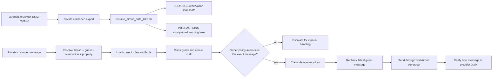

# Airbnb Response Automation Runbook

## Status

The workflow now has a **guarded low-stakes sender**. It polls an already
authorized Airbnb host inbox, evaluates only unread threads, and can send only
when a durable owner-policy authorization passes. All other messages remain
held for manual review. A real customer send is not yet verified: the current
inbox had no eligible unread guest question during the controlled run. The
approved private local OpenAI credential is configured in the ignored local
environment, and a grounded live-model response was verified without exposing
the credential.

## Prepared workflow artifacts

| Responsibility | Reusable artifact | Boundary |
|---|---|---|
| Response decision and draft | `airbnb_agent/bookings/airbnb_response_workflow.py` | Produces grounded drafts and coordinates durable authorization. |
| Authorization ledger | `airbnb_agent/bookings/airbnb_outbound.py` | Stores hashes, policy, rule digest, expiry, idempotency, and delivery state in the private Object Lake. |
| Inbox runner | `airbnb_agent/scripts/airbnb_low_stakes_responder.mjs` | Uses semantic Airbnb DOM controls, rechecks the latest inbound message, sends, and verifies provider DOM evidence. |
| Private job command | `process_airbnb_auto_response` | Prepares, claims, completes, or quarantines one protected job without exposing message text on the command line. |
| Fifteen-minute scheduler | Codex heartbeat `mladis-airbnb-low-stakes-inbox-responder` | Runs the guarded inbox processor against the already-authorized browser session; it stays quiet when nothing is eligible. |
| One-message draft command | `airbnb_agent/bookings/management/commands/draft_airbnb_response.py` | Accepts one private structured message and returns a draft-only result. |
| Read-only Airbnb capture | `airbnb_agent/scripts/capture_airbnb_messages.mjs` | Reads rendered DOM through an already-authorized host session. |
| New-only lake resume | `airbnb_agent/scripts/resume_airbnb_data_lake.sh` | Imports only unseen conversation and reservation captures. |
| Customer-service rules | `docs/business/operations/customer-service-playbook.md` | Supplies rules-first response and escalation guidance. |
| Behavior mapping | `docs/business/operations/airbnb-platform-behavior-map.md` | Maps guest, staff, agent, and system behavior to MLADIS objects and capabilities. |
| Listing improvement | `docs/business/operations/airbnb-listing-improvement-runbook.md` | Turns recurring questions and outcomes into approved listing proposals. |

The browser adapter never receives authority from a boolean alone. It must
present the exact thread hash, latest inbound-message hash, draft hash,
property, and current rules digest to claim a short-lived authorization.

## Workflow



The two paths are intentionally separate:

- **Operations path:** a protected message remains identifiable long enough to
  resolve the correct conversation, guest, reservation, and property before
  rules-first drafting and staff review.
- **Learning path:** a separate projection redacts names, contact values,
  source identifiers, and thread references before writing to
  `INTERACTIONS`. The learning record must never be used to resolve an active
  guest or reservation.

1. Capture only rendered Airbnb DOM through the authorized host session.
2. Run the new-only lake wrapper. It resumes from
   `BOOKINGS/.airbnb_capture_state.json`, skips unchanged source content, and
   still accepts a new message or changed reservation state in an existing
   thread.
3. For a controlled draft, pipe one private customer message to the
   draft command from stdin or a protected file. The command generates an
   internal MLADIS conversation with an MLADIS-generated session ID and prints
   the structured draft result; the customer message is not written to Git.
4. Review the language, facts, promised actions, and escalation classification.
5. Automatic authorization is limited to the owner-approved low-stakes policy
   below. Everything else requires manual review.
6. Record provider evidence or quarantine delivery as uncertain. Never retry
   an uncertain send automatically.

The response formatter must keep drafts concise: short paragraphs, one idea per
paragraph, and only the facts needed for the next decision. A greeting is fine
when it is its own paragraph; never combine it with the first substantive idea
or follow it with a wall of text. Before drafting from older guidance, compare
the rule wording with the current property record and correct grammar or
ambiguity.

## Draft command

From the repository:

```bash
cd airbnb_agent
cat /private/path/customer-message.txt | \
  .venv/bin/python manage.py draft_airbnb_response \
  --item-id 123
```

The draft command remains draft-only. The separate private job command and
browser runner own authorization and delivery.
The message must come from a private, authorized test flow and must not be
placed in shell history, process arguments, ordinary logs, fixtures, commits,
or issue text. Use a protected file instead of putting message text on a
command line. The JSON output contains the proposed reply, so redirect it
only to an approved protected review destination rather than CI or shell logs.

The command does not accept an external `--session-id`. The workflow generates
an internal session identifier so an Airbnb thread ID cannot accidentally
become an MLADIS session key.

## Low-stakes gate

The workflow may classify a draft as low-stakes for narrow factual topics, but
automatic sending is narrower: only `location`, `amenities`, and `services`
may auto-authorize. Availability remains manual because it changes over time.
Broad general
questions and blanket house-rule questions remain manual-review topics. Pricing,
deposits, payments, refunds, cancellations, damage, complaints, safety, legal
questions, discounts, guarantees, special exceptions, birthdays, events,
day-use requests, common-area use, contradictory guest counts, and unregistered
visitors always require manual handling. A small, normal gathering may be
allowed when it fits the applicable property rules, permitted hours, noise
limits, registered guest limits, visitor rules, and advance-notice or approval
requirements; the word "gathering" is a review trigger, not proof that every
gathering is prohibited. The response must distinguish registered overnight
guests from the total people proposing to use the property and must never
approve the request before staff confirms the conditions. A low-stakes
classification is not permission to send; the durable policy gate is required.

The detailed property-specific rules and service response ladder are maintained
in the [Customer Service Playbook](./customer-service-playbook.md). The sender
additionally requires a recognized topic, resolved property and
current factual sources, no conflicting source data, and no escalation signal.
Classification alone is never permission to send. Setup-mode and fallback-mode
drafts are never auto-send eligible; only a successful, recognized model mode
can proceed to the approval checks.

Approval is represented by a durable `OutboundResponseAuthorization` object
bound to the draft hash, owner-approved policy, property and thread
context, rules/facts/grounding version, expected latest customer-message
reference, expiration, and an unused idempotency key. Send-time validation must
fail closed unless the reviewer is authorized, the draft and destination still
match, the latest customer message has not changed, current facts and rules
have no conflicts, the intent is explicitly allowed, and the idempotency key
has not been used. A boolean `approved` flag alone is insufficient.

The authorization lasts ten minutes. A second sender cannot claim an
authorization in `sending`, `sent`, or `delivery_uncertain` state. A changed
message or property rule invalidates the claim.

The local Codex heartbeat checks at fifteen-minute intervals. It processes at
most five unread threads per run and must use the committed responder rather
than reproducing response rules in its prompt. It reports only a verified send,
an uncertain delivery, or a browser/model/runtime blocker. Closing the Codex
app, signing out of Airbnb, or closing the authorized browser session prevents
the browser-side job from running; those conditions never authorize a fallback
send.

Property grounding must prove that the property is active, required facts are
present and current, applicable rules are loaded, no conflicts remain, and no
restricted fact is disclosed.

When a reservation is discussed, the reservation holder must be treated as the
sole responsible party for everything that happens during the reservation,
regardless of who does what. This responsibility statement does not authorize
visitors or change a property's guest-count, day-use, or gathering rules.

## Controlled live test protocol

For a controlled test, the host may designate one real customer thread and
confirm that the assigned staff member will not respond during the test
window. The operator must:

1. verify the exact thread and latest customer message in the authorized host
   browser;
2. run the draft workflow without sending;
3. compare the draft against the actual question, current listing facts, and
   MLADIS communication standards;
4. show the exact proposed reply, destination thread, and action to the owner;
5. confirm that the message is within the pre-approved low-stakes policy or
   obtain immediate confirmation for a one-message manual test;
6. record whether the customer replied and whether the draft resolved the
   question.

Do not use a manual test against a customer who has not been identified by the
host. An automatic response must pass the current message-bound policy; a broad
prior instruction alone is never sufficient. Do not expose the customer's name
or message in Git documentation.

### Verified interpretation case

One controlled draft test used the private active Airbnb thread where a guest
first proposed a daytime birthday use for ten people, then clarified that only
five would sleep overnight. The workflow correctly kept the case in manual
review. For the one-night property involved, the rules-first interpretation is
that the reservation is for registered overnight guests only: it is not day use
and does not permit visitors or additional people to gather at the property.
The reservation holder is solely responsible for everything during the
reservation, regardless of who does what. Parties are not allowed where the
property rules prohibit them. A birthday or gathering is not automatically a
party, but the agent must not infer approval; it must escalate when the facts
are unclear. The first permissive practice draft was not sent, the composer
was cleared, and no customer-facing draft remains.

When the platform supports editing or unsending a practice message, use that
instead of sending successive correction messages. Any message outside the
automatic low-stakes policy remains an internal draft for staff review. A
practice correction is not customer-facing evidence unless the resulting
customer-visible state is observed.

## Evidence and limitations

The browser-to-Django runner has been exercised against the authorized Airbnb
inbox in both no-send and send-enabled modes. It found the unread row,
correctly skipped a platform reservation event that was not a guest-authored
question, and preserved its unread state. The sender contract passes automated tests with a fake provider,
including stale-message, changed-rule, and duplicate-send blocking. A real
customer send remains unclaimed until an eligible unread question is processed
and provider delivery is observed.

Related records:

- [Airbnb collection runbook](../../data-store/airbnb-collection-runbook.md)
- [Anonymous interaction contract](../../data-store/anonymous-interaction-lake-contract.md)
- [Airbnb-to-MLADIS behavior map](airbnb-platform-behavior-map.md)
- [Airbnb listing improvement runbook](airbnb-listing-improvement-runbook.md)
- [Feature verification plan](../../qa/full-site-functional-verification-plan.md)
