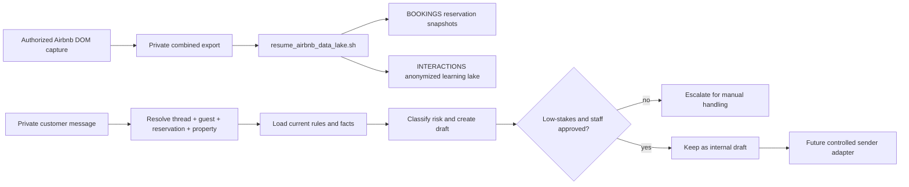

# Airbnb Response Automation Runbook

## Status

The workflow is **prepared and draft-only**. It can accept one private Airbnb
message as input and produce an internal MLADIS response draft, but it cannot
send to Airbnb and must not write directly to a customer. This preparation pass
does **not** test the workflow with a real customer.

This is intentional. The collector is read-only, and the response workflow
must not silently represent MLADIS to a customer.

## Prepared workflow artifacts

| Responsibility | Reusable artifact | Boundary |
|---|---|---|
| Response decision and draft | `airbnb_agent/bookings/airbnb_response_workflow.py` | Produces an internal draft; it has no sender. |
| One-message draft command | `airbnb_agent/bookings/management/commands/draft_airbnb_response.py` | Accepts one private structured message and returns a draft-only result. |
| Read-only Airbnb capture | `airbnb_agent/scripts/capture_airbnb_messages.mjs` | Reads rendered DOM through an already-authorized host session. |
| New-only lake resume | `airbnb_agent/scripts/resume_airbnb_data_lake.sh` | Imports only unseen conversation and reservation captures. |
| Customer-service rules | `docs/business/operations/customer-service-playbook.md` | Supplies rules-first response and escalation guidance. |
| Behavior mapping | `docs/business/operations/airbnb-platform-behavior-map.md` | Maps guest, staff, agent, and system behavior to MLADIS objects and capabilities. |
| Listing improvement | `docs/business/operations/airbnb-listing-improvement-runbook.md` | Turns recurring questions and outcomes into approved listing proposals. |

There is deliberately no Airbnb sender adapter in this workflow. A future
sender requires a separate implementation, staff approval gate, and an
explicitly authorized live test. The current prepared process ends at an
internal draft and review record.

## Workflow



The two paths are intentionally separate:

- **Operations path:** a protected message remains identifiable long enough to
  resolve the correct conversation, guest, reservation, and property before
  rules-first drafting and staff review.
- **Learning path:** a separate projection redacts names, contact values,
  source identifiers, and thread references before writing to
  `INTERACTIONS`. The learning record must never be used to resolve an active
  guest or reservation.

1. Capture only rendered Airbnb DOM through the authorized host session.
2. Run the new-only lake wrapper. It resumes from
   `BOOKINGS/.airbnb_capture_state.json`, skips unchanged source content, and
   still accepts a new message or changed reservation state in an existing
   thread.
3. For a future controlled test, pipe one private customer message to the
   draft command from stdin or a protected file. The command generates an
   internal MLADIS conversation with an MLADIS-generated session ID and prints
   the structured draft result; the customer message is not written to Git.
   This preparation pass does not run the command against a real customer.
4. Review the language, facts, promised actions, and escalation classification.
5. Obtain staff confirmation immediately before any future send action.
6. Record the result and evidence in the verification tracker.

The response formatter must keep drafts concise: short paragraphs, one idea per
paragraph, and only the facts needed for the next decision. A greeting is fine
when it is its own paragraph; never combine it with the first substantive idea
or follow it with a wall of text. Before drafting from older guidance, compare
the rule wording with the current property record and correct grammar or
ambiguity.

## Draft command

From the repository:

```bash
cd airbnb_agent
cat /private/path/customer-message.txt | \
  .venv/bin/python manage.py draft_airbnb_response \
  --item-id 123
```

The command returns `send_status: "draft_only"`. It never sends a message.
The message must come from a private, authorized test flow and must not be
placed in shell history, process arguments, ordinary logs, fixtures, commits,
or issue text. Use a protected file instead of putting message text on a
command line. The JSON output contains the proposed reply, so redirect it
only to an approved protected review destination rather than CI or shell logs.

The command does not accept an external `--session-id`. The workflow generates
an internal session identifier so an Airbnb thread ID cannot accidentally
become an MLADIS session key.

## Low-stakes gate

The workflow may classify a draft as low-stakes only for narrow, factual
availability, location, amenities, or services questions. Broad general
questions and blanket house-rule questions remain manual-review topics. Pricing,
deposits, payments, refunds, cancellations, damage, complaints, safety, legal
questions, discounts, guarantees, special exceptions, birthdays, events,
day-use requests, common-area use, contradictory guest counts, and unregistered
visitors always require manual handling. A small, normal gathering may be
allowed when it fits the applicable property rules, permitted hours, noise
limits, registered guest limits, visitor rules, and advance-notice or approval
requirements; the word "gathering" is a review trigger, not proof that every
gathering is prohibited. The response must distinguish registered overnight
guests from the total people proposing to use the property and must never
approve the request before staff confirms the conditions. A low-stakes
classification is not permission to send; the staff approval gate is still
required.

The detailed property-specific rules and service response ladder are maintained
in the [Customer Service Playbook](./customer-service-playbook.md). A future
sender must additionally require a recognized topic, resolved property and
current factual sources, no conflicting source data, and no escalation signal.
Classification alone is never permission to send. Setup-mode and fallback-mode
drafts are never auto-send eligible; only a successful, recognized model mode
can proceed to the approval checks.
The current implementation remains draft-only and hard-disables sender
execution, even when a callable is injected, until the durable authorization
object and send-time validation below exist.

Before a future sender is enabled, approval must be represented by a durable
`ResponseReview` or `OutboundResponseAuthorization` object bound to the draft
ID and hash, reviewer identity and time, property and reservation/thread
context, rules/facts/grounding version, expected latest customer-message
reference, expiration, and an unused idempotency key. Send-time validation must
fail closed unless the reviewer is authorized, the draft and destination still
match, the latest customer message has not changed, current facts and rules
have no conflicts, the intent is explicitly allowed, and the idempotency key
has not been used. A boolean `approved` flag alone is insufficient.

Property grounding must prove that the property is active, required facts are
present and current, applicable rules are loaded, no conflicts remain, and no
restricted fact is disclosed.

When a reservation is discussed, the reservation holder must be treated as the
sole responsible party for everything that happens during the reservation,
regardless of who does what. This responsibility statement does not authorize
visitors or change a property's guest-count, day-use, or gathering rules.

## Future controlled test protocol

For a controlled test, the host may designate one real customer thread and
confirm that the assigned staff member will not respond during the test
window. The operator must:

1. verify the exact thread and latest customer message in the authorized host
   browser;
2. run the draft workflow without sending;
3. compare the draft against the actual question, current listing facts, and
   MLADIS communication standards;
4. show the exact proposed reply, destination thread, and action to the owner;
5. obtain an immediate action-time confirmation before sending one message;
6. record whether the customer replied and whether the draft resolved the
   question.

Do not test against a customer who has not been identified by the host, and do
not send a response merely because a prior instruction authorized automation.
Do not expose the customer's name or message in Git documentation.

### Verified interpretation case

One controlled draft test used the private active Airbnb thread where a guest
first proposed a daytime birthday use for ten people, then clarified that only
five would sleep overnight. The workflow correctly kept the case in manual
review. For the one-night property involved, the rules-first interpretation is
that the reservation is for registered overnight guests only: it is not day use
and does not permit visitors or additional people to gather at the property.
The reservation holder is solely responsible for everything during the
reservation, regardless of who does what. Parties are not allowed where the
property rules prohibit them. A birthday or gathering is not automatically a
party, but the agent must not infer approval; it must escalate when the facts
are unclear. The first permissive practice draft was not sent, the composer
was cleared, and no customer-facing draft remains.

When the platform supports editing or unsending a practice message, use that
instead of sending successive correction messages. The agent workflow should
produce an internal draft for staff review, not write directly to Airbnb. A
practice correction is not customer-facing evidence unless the owner explicitly
confirms a send and the resulting customer-visible state is observed.

## Evidence and limitations

The workflow test is not a claim that Airbnb sending, provider callbacks,
scheduled jobs, or cancellation/payment actions work. Those require separate
safe tests. The current implementation has no active Airbnb sender adapter;
therefore any attempted send fails closed with a draft-only error.

Related records:

- [Airbnb collection runbook](../../data-store/airbnb-collection-runbook.md)
- [Anonymous interaction contract](../../data-store/anonymous-interaction-lake-contract.md)
- [Airbnb-to-MLADIS behavior map](airbnb-platform-behavior-map.md)
- [Airbnb listing improvement runbook](airbnb-listing-improvement-runbook.md)
- [Feature verification plan](../../qa/full-site-functional-verification-plan.md)
